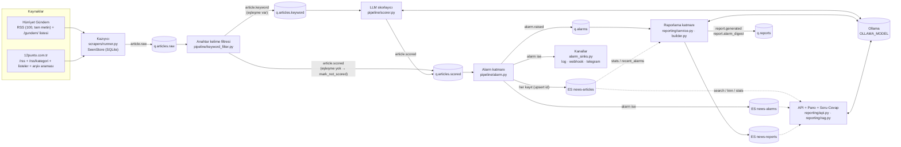
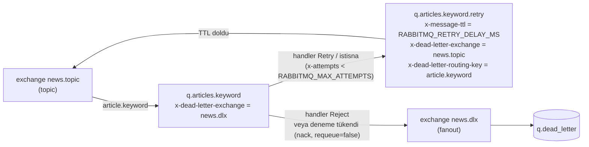
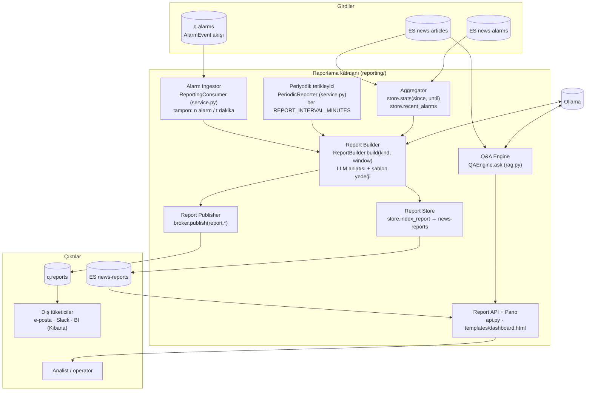

# scraperhryt — Mimari

Bu belge sistemin bileşenlerini, mesaj sözleşmesini, hata davranışını, **raporlama katmanının** ve **RAG
soru-cevap** motorunun tasarımını anlatır. Modül sınırları ve imzalar için [`BUILD_SPEC.md`](BUILD_SPEC.md),
işletme adımları için [`RUNBOOK.md`](RUNBOOK.md) esastır.

İçindekiler

1. [Bileşen diyagramı](#1-bileşen-diyagramı)
2. [Bir haberin yolculuğu](#2-bir-haberin-yolculuğu)
3. [Mesaj sözleşmesi](#3-mesaj-sözleşmesi)
4. [Hata yönetimi matrisi](#4-hata-yönetimi-matrisi)
5. [Raporlama katmanı mimarisi](#5-raporlama-katmanı-mimarisi)
6. [RAG tasarımı](#6-rag-tasarımı)
7. [Ölçekleme ve işletme](#7-ölçekleme-ve-işletme)
8. [Güvenlik](#8-güvenlik)

---

## 1. Bileşen diyagramı



Kuyruk topolojisinin yeniden deneme ve ölü mektup kısmı (her ana kuyruk için aynı desen):



Bileşenler ve sorumlulukları:

| Bileşen | Modül | Girdi → Çıktı | Durum |
|---------|-------|---------------|-------|
| Kazıyıcı | `scrapers/runner.py`, `scrapers/hurriyet.py`, `scrapers/punto.py`, `scrapers/base.py`, `scrapers/state.py` | Siteler → `article.raw` | `SeenStore` (SQLite WAL): id → `content_hash`, son görülme, besleme damgası |
| Anahtar kelime filtresi | `pipeline/keyword_filter.py`, `textutil.KeywordMatcher` | `q.articles.raw` → `article.keyword` / `article.scored` | durumsuz |
| LLM skorlayıcı | `pipeline/scorer.py`, `pipeline/llm.py`, `pipeline/prompts.py` | `q.articles.keyword` → `article.scored` | durumsuz (Ollama dış bağımlılık) |
| Alarm katmanı | `pipeline/alarm.py`, `alarm_sinks.py`, `store.py` | `q.articles.scored` → ES + `alarm.raised` + kanallar | durum ES'te (`news-alarms` ile idempotentlik) |
| Raporlama katmanı | `reporting/service.py`, `reporting/builder.py`, `reporting/prompts.py` | `q.alarms` + ES → `news-reports` + `report.*` | bellek içi alarm tamponu + son özet zamanı |
| API / Pano / Soru-Cevap | `reporting/api.py`, `reporting/rag.py`, `reporting/templates/dashboard.html` | HTTP → ES + Ollama | durumsuz |
| Ortak | `config.py` (Settings), `models.py` (NewsRecord, AlarmEvent, Report, Answer), `broker.py`, `textutil.py`, `logging_setup.py`, `cli.py` | — | — |

---

## 2. Bir haberin yolculuğu

Aşağıdaki sıra, anahtar kelime eşleşen ve alarm verilen bir haberin aşamalarını ve nesnenin her aşamada nasıl
zenginleştiğini gösterir. Her aşama **aynı** `NewsRecord`'u okur, alanlarını doldurur ve bir sonraki routing key
ile yeniden yayınlar.

```mermaid
sequenceDiagram
    autonumber
    participant S as Kazıyıcı
    participant Q1 as q.articles.raw
    participant F as Anahtar kelime filtresi
    participant Q2 as q.articles.keyword
    participant L as LLM skorlayıcı
    participant O as Ollama
    participant Q3 as q.articles.scored
    participant A as Alarm katmanı
    participant ES as Elasticsearch
    participant Q4 as q.alarms
    participant R as Raporlama katmanı

    S->>S: discover() → fetch_article() → NewsRecord.new(...) (id, content_hash, stage=raw)
    S->>S: SeenStore.status(id, content_hash) = new | updated
    S->>Q1: publish article.raw (headers x-source, x-change)
    Q1->>F: NewsRecord
    F->>F: KeywordMatcher.find(title+subtitle+content) → matched_keywords=["bakan","fon"], stage=keyword
    F->>Q2: publish article.keyword
    Q2->>L: NewsRecord
    L->>O: POST /api/chat (system=rubrik, user=haber, format=json)
    O-->>L: {"alarm_score": 85, "is_alarm": true, "reason": "...", "summary": "...", "topics": [...], "entities": [...]}
    L->>L: build_verdict → LLMVerdict; apply_verdict(threshold): alarm_score, is_alarm, alarm_reason, llm_summary, llm, stage=scored, processed_at
    L->>Q3: publish article.scored
    Q3->>A: NewsRecord
    A->>A: stage=alarm; AlarmEvent.from_record → alarm_id = sha1(id:content_hash)[:20]
    A->>ES: get_alarm(alarm_id) → yok (ilk kez)
    A->>ES: index news-articles (id) — alarm_id, alarmed_at dolu
    A->>A: sinks.send(event) → channels_notified
    A->>Q4: publish alarm.raised (AlarmEvent, içinde record)
    A->>ES: index news-alarms (alarm_id)
    Q4->>R: AlarmEvent
    R->>R: tampona ekle; REPORT_DIGEST_EVERY / REPORT_DIGEST_MINUTES dolunca
    R->>ES: stats(window) + recent_alarms → Report(kind=alarm_digest) → index news-reports
    R->>R: publish report.alarm_digest → q.reports
```

Nesnenin aşama aşama zenginleşmesi:

| Aşama (`stage`) | Kim yazar | Doldurulan alanlar |
|-----------------|-----------|--------------------|
| `raw` | kazıyıcı | `id`, `source`, `content_url` (kanonik), `title`, `subtitle`, `published_at`, `updated_at`, `content`, `category`, `author`, `image_url`, `tags`, `scraped_at`, `content_hash` |
| `keyword` | filtre | `matched_keywords` (eşleşen anahtar kelimeler; `LLM_SCORE_ALL` ile boş olabilir) |
| `scored` | skorlayıcı **veya** filtre (`mark_not_scored`) | `alarm_score`, `is_alarm`, `alarm_reason`, `llm_summary`, `llm` (ham karar: model, reason, summary, topics, entities, latency_ms, attempts, raw), `processed_at` |
| `alarm` | alarm katmanı | alarmsa `alarm_id`, `alarmed_at`; her kayıt ES'e yazılır |
| `reported` | raporlama | ayrılmış değer; raporlar ayrı `Report` nesnesidir, kayıt yeniden yazılmaz |

Anahtar kelime eşleşmeyen haber 5-9 adımlarını atlar: filtre `mark_not_scored()` ile `alarm_score=0`,
`is_alarm=false`, boş `alarm_reason`/`llm_summary` yazar ve doğrudan `article.scored` yayınlar; alarm katmanı onu
yalnızca `news-articles`'a yazar.

---

## 3. Mesaj sözleşmesi

### 3.1 Gövde

Tüm mesajlar `application/json`, UTF-8, kalıcı (`delivery_mode=2`); `message_id` özelliği gövdedeki `id` /
`alarm_id` / `report_id` alanından türetilir.

| Routing key | Gövde | Üretici |
|-------------|-------|---------|
| `article.raw`, `article.keyword`, `article.scored` | `NewsRecord.to_message()` (`schema_version`, `id`, `source`, `content_url`, `title`, `subtitle`, `published_at`, `updated_at`, `content`, `category`, `author`, `image_url`, `tags`, `language`, `scraped_at`, `content_hash`, `stage`, `matched_keywords`, `alarm_score`, `is_alarm`, `alarm_reason`, `llm_summary`, `llm`, `alarm_id`, `alarmed_at`, `processed_at`) | kazıyıcı / filtre / skorlayıcı |
| `alarm.raised` | `AlarmEvent.to_message()` (`alarm_id`, `record_id`, `source`, `content_url`, `title`, `subtitle`, `published_at`, `alarm_score`, `alarm_reason`, `llm_summary`, `matched_keywords`, `raised_at`, `channels_notified`, `acknowledged`, `record` = tam `NewsRecord`) | alarm katmanı |
| `report.generated`, `report.alarm_digest` | `Report.to_message()` (`report_id`, `kind`, `window_start`, `window_end`, `generated_at`, `stats`, `narrative`, `top_alarms`, `model`) | raporlama katmanı |

`schema_version` (şu an 1) tüketicilerin ileride uyumsuz değişiklikleri ayırt etmesi içindir. Tarihler ISO-8601 ve
saat dilimlidir. Tüketiciler gövdeyi `NewsRecord.from_message()` ile doğrular; doğrulama hatası `Reject` demektir.

`stage` değerleri: `raw` → `keyword` → `scored` → `alarm` → `reported`.

### 3.2 Başlıklar

| Başlık | Kim ekler | Anlamı |
|--------|-----------|--------|
| `x-attempts` | broker (yeniden deneme yolunda) | O ana kadar başarısız deneme sayısı. Mesaj ilk yayınında yoktur (0 sayılır). |
| `x-error` | broker | Son başarısız denemenin hata metni (500 karaktere kısaltılır). |
| `x-origin-queue` | broker | Mesajın başarısız olduğu ana kuyruk (retry kuyruğundan geri dönerken izlenebilirlik). |
| `x-death` | RabbitMQ | Ölü mektup geçmişi (kuyruk, neden, sayaç, orijinal routing key). |
| `x-source`, `x-change` | kazıyıcı | Kaynak adı ve `new` / `updated` (aynı id, farklı `content_hash`). |

### 3.3 Teslim semantiği

- Tüketici işleyicisi (`handler(msg)`) **normal dönerse** mesaj `ack`'lenir.
- `Reject` fırlatırsa mesaj yeniden denenmeden `nack(requeue=false)` ile `news.dlx` → `q.dead_letter`'a gider
  (bozuk JSON, şema doğrulama hatası).
- Başka bir istisna (`Retry` dahil: LLM/ES erişilemiyor) fırlatırsa `x-attempts` bir artırılır; sınırın altındaysa
  mesaj `<kuyruk>.retry`'a yazılıp orijinal `ack`'lenir; `x-message-ttl` (`RABBITMQ_RETRY_DELAY_MS`, varsayılan
  15 s) dolunca `news.topic`'e aynı routing key ile geri düşer. `x-attempts >= RABBITMQ_MAX_ATTEMPTS` (5) olunca
  mesaj ölü mektuba gider. Son deneme başlıkları güncellemeden düştüğü için ölü mektuptaki `x-attempts` değeri
  `RABBITMQ_MAX_ATTEMPTS - 1` olarak görünür; son hatanın metni tüketici günlüğündedir.
- Retry kuyruğuna yazma başarısız olursa mesaj `nack(requeue=true)` ile broker'a iade edilir (kayıp yok).
- Teslim **en az bir kez**'dir; tüm tüketiciler idempotent yazılmıştır (bkz. §4 ve §7).
- Bellek içi broker (`InMemoryBroker`) aynı semantiği (topic binding, retry, ölü mektup) tek süreçte taklit eder;
  testler ve `--in-memory` modu bunu kullanır.

---

## 4. Hata yönetimi matrisi

| Durum | Nerede yakalanır | Davranış | Veri kaybı? |
|-------|------------------|----------|-------------|
| Site erişilemiyor / zaman aşımı / 5xx / 429 | `scrapers/base.HttpClient` (tenacity) | 3 denemeye kadar üstel geri çekilme; sonra haber başına hata sayılır, tur devam eder; keşif (RSS/liste) tamamen başarısızsa kaynak o turda atlanır, `SCRAPE_INTERVAL_SECONDS` sonra tekrar denenir | Hayır; haber bir sonraki turda yeniden keşfedilir (RSS 100 / 20 öğe tutar) |
| Hürriyet haber sayfası alınamıyor | `HurriyetSource.fetch_article` | RSS'teki tam metin (`<text>`) ve spot (`<abstract>`) ile kayıt üretilir | Hayır |
| Sayfa yapısı değişti, ayrıştırılamıyor | kaynak sınıfı → `None` | Haber `skipped` sayılır, uyarı loglanır; fixture testleri (`tests/test_scrapers.py`) kırılmayı erken gösterir | Haber atlanır |
| Bozuk/geçersiz mesaj gövdesi | her tüketici (`NewsRecord.from_message` → `ValidationError`) | `Reject` → anında `q.dead_letter` | Mesaj ölü mektupta incelenebilir |
| Ollama kapalı / zaman aşımı / 5xx / model yok (`LLMUnavailable`) | `ScoringService.score_record` | `Retry` → `q.articles.keyword.retry` → 15 s sonra tekrar; 5 denemeden sonra ölü mektup | Hayır; Ollama gelince kuyruk boşalır, ölü mektuplar yeniden oynatılır |
| LLM JSON yerine metin üretti (`LLMBadOutput`) | `ScoringService.score_record` | Süreç içinde en fazla 3 deneme (ikinci ve üçüncüde katı JSON uyarısı eklenir); yine olmazsa `Retry` → broker yeniden denemesi | Hayır |
| LLM geçerli ama anlamsız değer (`alarm_score: "85/100"`, `is_alarm: "evet"`, bilinmeyen konu) | `scorer.build_verdict` | Zorlayıcı dönüşüm: sayı dizeden çıkarılır ve 0-100'e sıkıştırılır, boolean Türkçe/İngilizce sözcüklerden çözülür, konu sabit listeye eşlenir; `alarm_score` yoksa `LLMBadOutput` | Hayır |
| Elasticsearch yazma hatası (bağlantı/transport) | `ElasticsearchStore._write` → `Retry` | Alarm ve raporlama tüketicileri mesajı retry kuyruğuna bırakır; alarm katmanı başlangıçta `ensure_indices` için 1 s → 30 s üstel bekleme ile ES'i bekler | Hayır (en fazla 5 denemeden sonra ölü mektup) |
| Elasticsearch okuma hatası (API, RAG) | `reporting/api.py` | HTTP 5xx; pano hata gösterir | — |
| RabbitMQ kapalı | `RabbitMQBroker` | Bağlanma 1 s → 30 s üstel geri çekilme (8 deneme), tüketici döngüsü koptuğunda 2 s sonra yeniden bağlanır; yayınlama 3 kez denenir, sonra `ConnectionError` (kazıyıcı turu kesilir, sonraki turda tekrar) | Yayınlanamayan haber `SeenStore`'a işaretlenmediği için sonraki turda yeniden yayınlanır |
| Aynı mesaj iki kez teslim edildi (ack kaybı, retry) | alarm katmanı | ES `index` by `id` → üzerine yazma (idempotent); `alarm_id` depoda varsa ve `content_hash` aynıysa kanallar ve `q.alarms` tekrarlanmaz. Alarm belgesi en son yazıldığı için yayın başarısız olursa yeniden denemede olay yine yayınlanır; bedeli nadiren çift bildirimdir | Hayır |
| Aynı haber güncellendi (aynı URL, yeni metin) | kazıyıcı `SeenStore.status = updated` | Aynı `id`, yeni `content_hash` ile `x-change=updated` olarak yeniden yayınlanır; yeniden skorlanır; alarm olursa yeni `alarm_id` üretilir (yeni içerik = yeni olay) | Önceki sürüm ES'te üzerine yazılır (tarihçe `news-alarms`'ta kalır) |
| Alarm kanalı (webhook/Telegram) hatası | `AlarmService._notify` | Loglanır, `channels_notified`'a eklenmez; işlem **devam eder** (asla ölümcül değil) | Bildirim kaybı; alarm ES ve `q.alarms`'ta |
| Embedding üretilemedi | `AlarmService._embedding_for` | Kayıt vektörsüz yazılır (BM25 ile yine aranabilir) | Hayır |
| Raporda LLM anlatısı üretilemedi | `ReportBuilder.build` | Şablon tabanlı Türkçe anlatı (istatistikler + en yüksek alarmlar) ile rapor yine üretilir | Hayır |
| Süreç SIGINT/SIGTERM aldı | `cli.py` paylaşılan `threading.Event` | Tüketiciler mevcut mesajı bitirip `ack`'ler, yeni mesaj almaz; kazıyıcı turu tamamlar/keser; bağlantılar kapanır | Hayır |

---

## 5. Raporlama katmanı mimarisi

Raporlama katmanı, alarm katmanının ürettiği olay akışını ve Elasticsearch'teki tüm haber geçmişini birleştirerek
**insan için okunabilir** çıktılar üretir: alarm özetleri, periyodik durum raporları, isteğe bağlı raporlar, pano
ve soru-cevap. Katmanın ilkeleri: (1) ham veri yerine **ES toplulaştırmaları** üzerinden çalışır, (2) LLM anlatısı
her zaman **şablonla yedeklenir**, (3) her rapor hem ES'te saklanır hem kuyruğa yayınlanır ki dış sistemler
(e-posta, Slack, BI) abone olabilsin.



### 5.1 Girdiler

| Girdi | Kullanım |
|-------|----------|
| `q.alarms` (`AlarmEvent`) | Gerçek zamanlı alarm akışı; alarm özetlerinin tetikleyicisi ve içeriği. Olay tam `record`'u taşıdığı için ES'e gitmeden özet kurulabilir. |
| `news-articles` | Pencere istatistikleri (toplam, alarm sayısı, kaynak/anahtar kelime/kategori dağılımı, saatlik seri, en yüksek alarmlar), arama ve RAG bağlamı. |
| `news-alarms` | Pencere içindeki alarm listesi (`recent_alarms`), kanallara bildirim geçmişi, `acknowledged` durumu. |

### 5.2 Alt bileşenler

**Alarm Ingestor — `ReportingConsumer(settings, broker, store, builder)`**
`q.alarms` tüketicisidir. Gelen `AlarmEvent`'leri bellek içi tamponda toplar; şu iki koşuldan biri sağlanınca
`alarm_digest` raporu ister: tamponda `REPORT_DIGEST_EVERY` (10) alarm birikti **veya** son özetten bu yana
`REPORT_DIGEST_MINUTES` (30) geçti ve tamponda en az bir alarm var. Rapor penceresi tampondaki ilk alarmın
`raised_at`'inden şimdiye kadardır. Rapor yazılıp yayınlanınca tampon boşalır. Tasarım gereği tampon bellek
içidir: süreç çökerse birikmiş ama henüz özetlenmemiş alarmlar o özete girmez; olaylar `news-alarms`'ta olduğu
için periyodik rapor onları yine kapsar (özet "en iyi çaba", alarmların kendisi "en az bir kez" garantilidir).

**Periyodik tetikleyici — `PeriodicReporter(settings, store, builder, broker)`**
`run_once()` son `REPORT_WINDOW_HOURS` (24) saat için `periodic` raporu üretir; `run(stop_event)` bunu her
`REPORT_INTERVAL_MINUTES` (60) dakikada tekrarlar. Pencere her zaman "şimdiden geriye" hesaplandığı için
yeniden başlatmalar boşluk bırakmaz; en kötü durumda aynı aralık iki raporda kesişir.

**Aggregator — `ArticleStore.stats(since, until)` / `recent_alarms(since, size)`**
Tek bir ES isteğiyle (`size=0`, `track_total_hits=true`) şu toplulaştırmaları alır:
`by_source` (terms), `by_keyword` (terms over `matched_keywords`), `by_category` (terms, boş hariç),
`alarms` (filter `is_alarm=true` → `avg_alarm_score`, `top_alarms` = skor ve tarihe göre ilk 10 `top_hits`),
`by_hour` (`date_histogram` 1 saat + alarm alt sayacı). Sonuç `stats` sözlüğüdür:
`total`, `alarms`, `by_source`, `by_keyword`, `by_category`, `avg_alarm_score`, `by_hour` (`[{ts, count,
alarms}]`), `top_alarms`. Bellek içi depo aynı sözlüğü Python'da hesaplar; raporlama kodu depo türünden bağımsızdır.

**Report Builder — `ReportBuilder(settings, store, llm).build(kind, window_start, window_end, *, narrative=True)`**
1. `stats = store.stats(window_start, window_end)`; `top_alarms = store.recent_alarms(since=window_start)` (skora
   göre sıralanır, ilk N).
2. `narrative=True` ise `reporting/prompts.py`'deki Türkçe rapor istemiyle `llm.generate_text(system, user)`
   çağrılır: istatistikler ve en yüksek alarmlar (başlık, skor, gerekçe, kaynak, tarih) tablo halinde modele verilir;
   model yönetici özeti, öne çıkan gelişmeler, kaynak/konu dağılımı ve izlenmesi gereken başlıklar bölümlerini
   yazar. `LLMUnavailable`/`LLMBadOutput` durumunda **şablon anlatı** (aynı bölümler, istatistikten doldurulmuş
   cümleler) kullanılır; `Report.model` alanı anlatıyı üreten modeli taşır.
3. `Report(report_id, kind, window_start, window_end, stats, narrative, top_alarms, model)` döner; `news-reports`'a
   `report_id` ile upsert edildiği için aynı raporun yeniden yazılması ikinci belge üretmez.

**Report Store — `store.index_report(report)` → `news-reports`**
`report_id` ile upsert. `stats` ve `top_alarms` `enabled: false` nesne olarak saklanır (sorgulanmaz, olduğu gibi
döner); `narrative` Türkçe analizörle aranabilir; `kind`, `window_*`, `generated_at` filtrelenebilir.

**Report Publisher — `broker.publish(RoutingKey.REPORT_GENERATED | REPORT_ALARM_DIGEST, report.to_message())`**
`q.reports` kuyruğu `report.#` ile bağlıdır; dış tüketiciler kendi kuyruklarını `report.alarm_digest` ya da
`report.generated` ile bağlayarak yalnızca istedikleri türü alabilir. Yayın, ES yazımından **sonra** yapılır;
yayın başarısız olursa tüketici `Retry` ile yeniden dener ve ES'teki belge üzerine yazılır (idempotent).

**Report API + Pano — `create_app(settings, store, llm, broker=None)`**

| Uç | Amaç |
|----|------|
| `GET /health` | Depo ve LLM sağlık özeti |
| `GET /articles/search` | Türkçe BM25 + yenilik ağırlıklı arama (parametreler `/docs`'ta) |
| `GET /articles/{id}` | Tek haber (`news-articles`) |
| `GET /alarms` | Son alarmlar (`news-alarms`) |
| `GET /reports` | Son raporlar; türe göre filtre |
| `POST /reports/generate` | `adhoc` rapor: verilen pencere için anında üretir, saklar ve `broker` verilmişse yayınlar |
| `GET /stats` | Pencere istatistikleri (pano kartları ve grafikleri) |
| `POST /ask` | RAG soru-cevap (`{"question": str, "since_days": int?, "top_k": int?}` → `Answer`) |
| `GET /` | Jinja2 pano: istatistikler, saatlik seri, son alarmlar, "Sor" kutusu (`fetch('/ask')`) |

**Q&A Engine — `QAEngine(settings, store, llm).ask(question, *, since_days=None, top_k=None, sources=None)`**
Ayrıntısı §6'da.

### 5.3 Rapor türleri ve tetikleyiciler

| `kind` | Tetikleyici | Pencere | Routing key | İçerik vurgusu |
|--------|-------------|---------|-------------|----------------|
| `alarm_digest` | `REPORT_DIGEST_EVERY` alarm **veya** `REPORT_DIGEST_MINUTES` dakika | tampondaki ilk alarm → şimdi | `report.alarm_digest` | Yeni alarmların listesi, ortak konular/varlıklar, aciliyet sıralaması |
| `periodic` | her `REPORT_INTERVAL_MINUTES` | son `REPORT_WINDOW_HOURS` | `report.generated` | Genel tablo: hacim, alarm oranı, kaynak/konu dağılımı, saatlik yoğunluk, en yüksek alarmlar |
| `adhoc` | `POST /reports/generate` | istekte verilen aralık | `report.generated` | Analistin seçtiği aralık için periodic ile aynı yapı |

`Report.kind` için `daily` değeri de modelde ayrılmıştır; 24 saatlik pencereli `periodic` rapor bunun işlevini
görür, ayrı bir zamanlayıcı yoktur.

### 5.4 Veri saklama ve ILM önerisi

İndeksler tek adlı (`news-articles`, `news-alarms`, `news-reports`) olduğundan en basit saklama politikası
zamanlanmış `delete_by_query`'dir (örn. gecelik):

```bash
curl -s -X POST "$ELASTICSEARCH_URL/news-articles/_delete_by_query?conflicts=proceed" \
  -H 'Content-Type: application/json' \
  -d '{"query": {"range": {"@timestamp": {"lt": "now-180d"}}}}'
```

Önerilen süreler: `news-articles` 180 gün (RAG için `RAG_RECENCY_DAYS` fazlasıyla karşılanır), `news-alarms`
1 yıl (denetim izi), `news-reports` süresiz (küçük). Hacim büyürse zaman tabanlı indeks adlarına geçip ILM
kullanın: `ES_INDEX_ARTICLES=news-articles-write` gibi bir **yazma alias'ı** tanımlayın, rollover'lı bir indeks
şablonu oluşturun ve şu politikayı bağlayın (hot 30 gün/50 GB → warm 60 gün → delete 180 gün):

```json
{
  "policy": {
    "phases": {
      "hot": {"actions": {"rollover": {"max_age": "30d", "max_primary_shard_size": "50gb"}}},
      "warm": {"min_age": "60d", "actions": {"forcemerge": {"max_num_segments": 1}, "set_priority": {"priority": 50}}},
      "delete": {"min_age": "180d", "actions": {"delete": {}}}
    }
  }
}
```

Depo kodu `index` adını `Settings`'ten okuduğu için alias'a yazmak değişiklik gerektirmez; `ensure_indices` var
olmayan adı oluşturmaya çalışacağından alias'ı ve ilk indeksi önceden oluşturun.

### 5.5 BI / Kibana entegrasyonu

`docker compose --profile kibana up -d` ile Kibana 5601'de açılır. Önerilen kurulum:

1. **Data view**'lar: `news-articles`, `news-alarms`, `news-reports` — zaman alanı `@timestamp`.
2. Panolar: saatlik haber/alarm sayısı (`by_hour` ile aynı sorgu: `date_histogram` + `is_alarm` filtresi),
   kaynak/kategori/anahtar kelime dağılımı (`source`, `category`, `matched_keywords` keyword alanları), ortalama
   `alarm_score`, `llm.topics` ve `llm.entities` üzerinden konu/varlık bulutu, `channels_notified` ile bildirim
   kapsama oranı.
3. **Discover** ile `alarm_reason` / `llm_summary` tam metin araması (Türkçe analizör).
4. Uyarılar (Kibana Alerting) için `news-alarms` üzerinde `alarm_score >= 80` eşiği; sistemin kendi kanalları
   (webhook/Telegram) buna ek olarak çalışır.

Başka BI araçları (Grafana ES data source, Metabase) aynı indeksleri doğrudan okuyabilir; `q.reports`'a abone
olan bir tüketici raporları e-posta/Slack'e taşıyabilir.

---

## 6. RAG tasarımı

Amaç: "Özgür Özel ile Kemal Kılıçdaroğlu arasındaki son durum ne?" gibi bir soruya, **sisteme en son giren
haberlerden** yola çıkarak, kaynak göstererek ve en güncel gelişmeyi öne alarak yanıt vermek. Motor
`reporting/rag.py` içindeki `QAEngine`'dir ve `FakeOllama` ile de (testlerde) çalışır.

### 6.1 Adımlar

1. **Sorgu yeniden yazma.** Soru, `reporting/prompts.py`'deki Türkçe istemle `llm.chat_json` ile
   `{"search_terms": [...], "entities": [...]}` biçimine çevrilir (ör. `["Özgür Özel", "Kemal Kılıçdaroğlu",
   "CHP", "tartışma", "kurultay"]`). LLM erişilemez ya da çıktı bozuksa sorunun kendi sözcükleri (Türkçe küçük
   harf, 2+ karakter, durak sözcükler atılmış) kullanılır. `Answer.search_terms` kullanılan terimleri gösterir.
2. **Hibrit geri getirme.**
   - *Sözlüksel:* `store.search_records(" ".join(search_terms), since=now - since_days, size=top_k, sources=...)`.
     ES'te bu `function_score(bool(multi_match title^3 / subtitle^2 / content / llm_summary^2 / alarm_reason,
     filtreler), gauss(@timestamp, scale=3d, offset=12h, decay=0.5))` sorgusudur: Türkçe analizör (apostrof
     ayırma + gövdeleme) sayesinde "Kılıçdaroğlu'nun" ↔ "Kılıçdaroğlu" eşleşir; `minimum_should_match: 2<60%` ve
     `fuzziness: AUTO` yazım farklarını tolere eder; **yenilik ağırlığı** 3 günden eski haberleri kademeli
     olarak geriye iter (12 saat tolerans). `since_days` varsayılanı `RAG_RECENCY_DAYS` (14), `top_k` varsayılanı
     `RAG_TOP_K` (12).
   - *Anlamsal (isteğe bağlı):* `OLLAMA_EMBEDDING_MODEL` ayarlıysa `llm.embed([question])` ile sorgu vektörü
     üretilir ve `store.knn_search(vector, k=top_k, since=...)` (ES `knn`, cosine, `num_candidates = max(50, 5k)`)
     çağrılır. Haber vektörleri alarm katmanında indekslenirken üretilir (`title + subtitle + content[:N]`).
   - *Birleştirme:* iki liste **Reciprocal Rank Fusion** ile birleştirilir: her belge için
     `score = Σ 1 / (60 + rank_i)`; aynı `id` tek belge olur. Vektör arama kapalıysa yalnızca BM25 sırası kullanılır.
3. **Bağlam kurma (en yeni önce).** Birleşik liste `published_at`'e göre **azalan** sıralanır ve her haber
   `[n] (dd.mm.yyyy HH:MM, kaynak) Başlık — alt başlık — içerik özeti` biçiminde numaralanır. İçerik, toplam
   bağlam `OLLAMA_NUM_CTX`'e sığacak şekilde haber başına kısaltılır (başlık ve alt başlık hiç kesilmez;
   LLM özeti varsa gövde yerine tercih edilir). En yeni haberin `[1]` olması, modelin "son durum"u doğru
   yerden okumasını kolaylaştırır.
4. **Yanıt üretimi.** Türkçe yanıt istemi modele şunları şart koşar: yalnızca verilen bağlamı kullan; **ilk
   cümlede en güncel durumu** ver, sonra geriye doğru kronolojiyi anlat; her iddianın sonuna `[n]` atıf koy;
   bağlam yetersiz/alakasızsa bunu açıkça söyle ("Elimdeki son N günlük haberlerde bu konuda yeterli bilgi yok");
   tahmin yürütme. `llm.generate_text` ile üretilen metin `Answer.answer` olur; `Answer.sources` bağlamdaki
   sırayla `Citation(id, title, content_url, source, published_at, score, snippet)` listesidir, `retrieved_count`
   bağlama giren haber sayısıdır. LLM erişilemezse yanıt, kaynak listesini ve en yeni haberin başlık/özetini içeren
   şablon metindir (yine atıflı).

### 6.2 Sınırlamalar

- Yalnızca sistemin **kazıdığı** haberler bilinir: Hürriyet Gündem RSS son 100 + liste, 12punto RSS/liste (+ arşiv
  taraması yapıldıysa geçmiş). İki site dışında kaynak yoktur; bir gelişme bu sitelerde yer almadıysa yanıt
  "yeterli bilgi yok" olmalıdır.
- `since_days` penceresi dışındaki haberler aranmaz; eski bir tartışmanın arka planı için `since_days`'i büyütün.
- Model hâlâ yanlış çıkarım yapabilir; atıflar doğrulanabilirlik içindir. Yanıt üretirken `OLLAMA_TEMPERATURE`
  düşük tutulur, ancak nihai doğrulama kullanıcıya aittir.
- Türkçe gövdeleme (Snowball) özel adlarda bazen aşırı kırpar; apostrof filtresi ve `fuzziness` bunu kısmen
  dengeler. `=`/`re:` türü anahtar kelime sözdizimi aramada değil, filtrede geçerlidir.
- Varlık çözümleme yoktur: "Özel" soyadı ile "özel" sıfatı aynı gövdeye iner; sorgu yeniden yazmanın tam ad
  üretmesi (`"Özgür Özel"`) bu gürültüyü azaltır.
- kNN için vektörler yalnızca `OLLAMA_EMBEDDING_MODEL` ayarlandıktan **sonra** indekslenen haberlerde vardır;
  geçmiş için yeniden indeksleme gerekir (RUNBOOK).

---

## 7. Ölçekleme ve işletme

- **Kuyruk başına birden çok tüketici.** Her katman bağımsız bir süreçtir; `docker compose up -d --scale scorer=3`
  gibi yatay ölçekleme doğrudan çalışır (RabbitMQ mesajları tüketicilere dağıtır). Darboğaz genellikle LLM'dir:
  skorlayıcı `prefetch=1` ile çalışır; Ollama tek GPU'da istekleri sıraya aldığı için ek skorlayıcı ancak ek Ollama
  örneği/GPU ile hız kazandırır. Alarm katmanı ve filtre `RABBITMQ_PREFETCH` (8) ile çalışır.
- **Kazıyıcı tek örnek.** `SeenStore` yerel SQLite dosyasıdır; aynı dosyayı paylaşan birden fazla kazıyıcı süreci
  gerekli değildir (iki site toplam birkaç yüz sayfa/tur). Kaynak bazında ayrım gerekirse `--source` ile ayrı
  süreçler ve ayrı `STATE_DB_PATH` kullanın.
- **Idempotent yazma.** ES'e `id`/`alarm_id`/`report_id` ile `index` (tam üzerine yazma) yapılır; aynı mesajın
  tekrar işlenmesi ikinci belge üretmez. Alarm yükseltme `alarm_id = sha1(id:content_hash)` ile tekilleştirilir.
- **Yeniden teslim ve sıralama.** RabbitMQ kuyruk içinde FIFO'dur ama retry kuyruğundan dönen mesajlar sona
  ekleneceği için sıralama garantisi yoktur; tüm tüketiciler sıradan bağımsız tasarlanmıştır. Alarm katmanı
  `content_hash` karşılaştırmasıyla eski bir sürümün yeni sürümü ezmesini önleyemez (ES'te son yazan kazanır);
  bu pratikte yalnızca aynı haberin dakikalar içinde iki kez güncellenmesinde görülür ve bir sonraki turda düzelir.
- **Kaynak kontrolü.** `MAX_ARTICLES_PER_RUN` ve `REQUEST_DELAY_SECONDS` siteye yükü; `OLLAMA_MAX_CONTENT_CHARS` ve
  `OLLAMA_NUM_CTX` LLM maliyetini sınırlar. `LLM_SCORE_ALL=true` LLM yükünü 5-10 kat artırır; yalnızca küçük
  hacimde ya da yeterli GPU ile açın.
- **Gözlemlenebilirlik (mevcut).** Her servis başlangıç/durdurma ve mesaj başına tek satır INFO log üretir
  (iş parçacığı adı dahil); her tüketici `*Stats` veri sınıfında sayaç tutar (`FilterStats`, `ScoringStats`,
  `AlarmStats`, `ScrapeStats`) ve durdurulurken loglar. RabbitMQ yönetim arayüzü kuyruk derinliği/oranı için
  yeterlidir.
- **Eklenecek metrikler (öneri).** Sayaçları Prometheus `/metrics` ucuyla dışa açın: kaynak başına keşif/çekim/hata,
  anahtar kelime isabet oranı, LLM gecikmesi (`LLMVerdict.latency_ms`) ve deneme dağılımı, alarm oranı ve ortalama
  skor, ES yazma gecikmesi, retry/ölü mektup sayıları, `q.*` derinliği (RabbitMQ exporter). Uyarı önerileri:
  `q.dead_letter > 0`, `q.articles.keyword` derinliği 15 dakikadır artıyor, kazıyıcı 2 turdur 0 haber yayınladı.
- **Yeniden başlatma güvenliği.** Tüm servisler `declare_topology()` ve `ensure_indices()`'i idempotent çağırır;
  sıra önemsizdir. Mesajlar kalıcı, kuyruklar `durable`'dır; broker yeniden başlasa da kaybolmaz (disk yazımı
  RabbitMQ'ya bağlıdır; confirm delivery açıktır).

---

## 8. Güvenlik

- **Gizli bilgiler loglanmaz.** RabbitMQ URL'si log satırlarında parola gizlenerek yazılır (`amqp://guest:***@…`);
  Telegram bot token'ı hata mesajlarında `***` ile değiştirilir; webhook URL'si yalnızca şema+host olarak
  loglanır. `.env` git'e girmez (`.gitignore`).
- **Elasticsearch güvenliği yalnızca geliştirmede kapalıdır.** `docker-compose.yml` tek düğümlü, güvenliği
  kapalı ES başlatır. Üretimde `xpack.security` açık, TLS'li bir ES kullanın ve `ELASTICSEARCH_API_KEY` tanımlayın;
  9200 portunu dışarı açmayın.
- **RabbitMQ.** `guest/guest` yalnızca localhost için geçerlidir; üretimde ayrı kullanıcı/vhost tanımlayıp
  `RABBITMQ_URL`'ye yazın, 15672 yönetim arayüzünü ağ düzeyinde sınırlayın.
- **API.** FastAPI uygulaması kimlik doğrulama içermez; dışarı açılacaksa ters vekil (nginx/Caddy) arkasında
  temel kimlik doğrulama ya da ağ kısıtı uygulayın. `/ask` ve `/reports/generate` LLM çağrısı tetiklediği için
  oran sınırı koyun.
- **İstem enjeksiyonu.** Haber metni LLM'e `<<<HABER … HABER>>>` sınırlayıcıları içinde "veri" olarak verilir;
  model yalnızca JSON üretir, çıktı şemaya zorlanır ve alarm kararı deterministik politikadır. Yine de haber
  içeriğindeki talimatlar modeli etkileyebilir; skor ve özetler insan tarafından doğrulanmalıdır. Rapor ve RAG
  istemlerinde de aynı ayrım uygulanır (bağlam numaralı alıntı olarak verilir).
- **Veri asgariliği.** Yalnızca haber alanları saklanır; kullanıcı verisi yoktur. Saklama süresi için §5.4.
- **Kanallar.** Webhook'a tam `AlarmEvent` gider (haber metni dahil); hedefin TLS'li ve güvenilir olduğundan emin olun.
